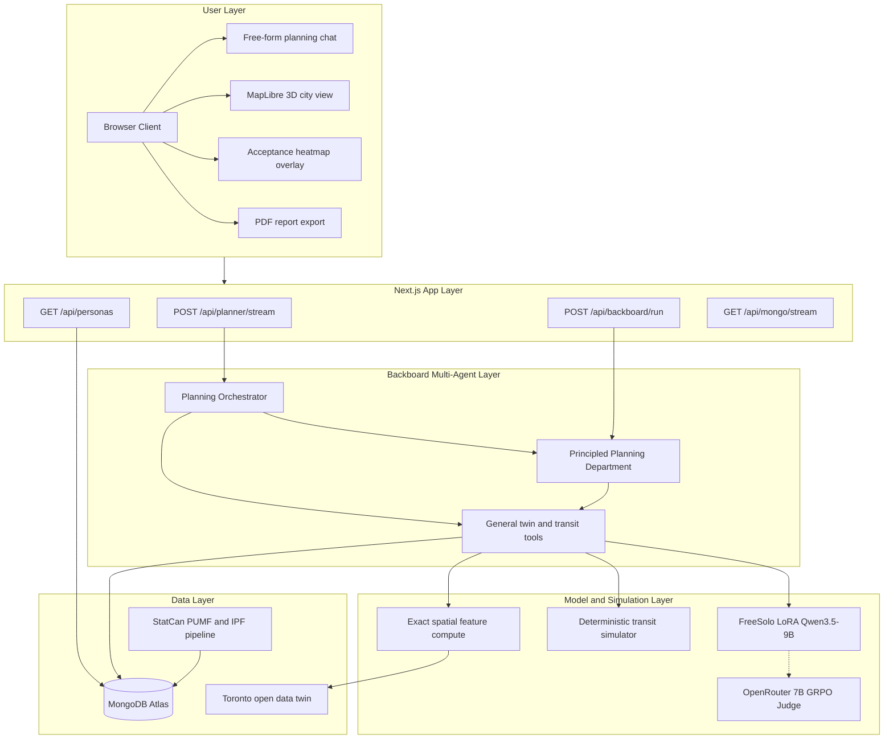

# TechTO
### Hear the city before you build it

---

### Inspiration

City planning still starts with a guess.

A planner proposes a tram on King Street, a parking tax citywide, or a schedule change at Union Station. They look at a map, a ridership chart, maybe a consultation report from five years ago. Then they try to imagine how people will feel about it on day one.

That guess is expensive. Bad acceptance kills projects. Uneven consultation leaves whole neighbourhoods out of the conversation. Toronto has 158 neighbourhoods, millions of residents, and open data everywhere, but the gap between a blueprint and a lived reaction is still mostly intuition.

We kept coming back to one question:

What if a planner could ask an arbitrary change, see a neighbourhood acceptance map, and read a human-legible reason from every affected voice, before anything is built?

That became TechTO.

---

### What it does

TechTO is a decision-support tool for Toronto city planners. A planner works in a Cities-Skylines-style MapLibre view of the city and, through chat, requests arbitrary changes. The system predicts how residents would react, returns a legible written opinion per affected group, and aggregates those into a neighbourhood sentiment map and a citywide distribution.

There are two surfaces:

- `/` is the open-city dashboard. Chat runs a live Planning Orchestrator with twin tools. The planner can inspect neighbourhoods, propose scenarios, fly the map, and when options are actually scored, see a day-one acceptance distribution.
- `/techto` is the transit demonstration. It runs a labelled synthetic schedule scenario through a multi-agent planning department, a deterministic transit simulator, and batched citizen reactions, then produces a constrained recommendation.

For example, a planner can say:

"Add a tram on King Street and raise parking tax 5% citywide to pay for it."

Or, in the transit demo:

"Stress-test schedule interventions at Union Station and show me how cohorts would react."

Users can:
- Explore a 3D MapLibre view of Toronto with real neighbourhood and TTC layers
- Chat in natural language with a free-form planning agent
- Propose and compare policy or transit options
- See a neighbourhood acceptance heatmap and citywide distribution
- Read simulated citizen opinions with written rationales
- Export planning answers as PDF reports
- Inspect agent timelines, stress tests, and hard-constraint overrides in the transit demo

The goal was not a prettier dashboard. The goal was to make public reaction something you can inspect before you commit.

Important boundary: TechTO predicts day-one acceptance feel. It does not claim ridership, land-value shifts, or third-year outcomes. Simulated reactions are not real public consultation.

---

### The Planning Orchestrator

The open-city chat is powered by a Backboard Planning Orchestrator.

It works like Claude Code for cities. The agent has free will each turn. It can answer in prose, call general twin tools, invoke a specialist, or mix all three. We do not force a scenario patch or a population score on every message. If the planner just asks a question, they get an answer. Rankings and acceptance maps appear only when the agent actually proposed and scored options.

Tools stay general: query, patch, run analysis, snapshot, diff, map actions. Domain competence lives in the model and the twin compiler, not in opinionated one-off tools like `add_tram_line`.

Backboard handles the assistant setup, thread flow, tool routing, and streaming. Our Next.js API layer turns that into SSE events the map and chat can render live.

---

### The Planning Department

Behind the orchestrator sits a principled eleven-role planning department on Backboard. We did not ship niche one-use-case specialists. We grouped competence into four bands:

1. **Conversation** — front-door copilot that classifies intent and hands complex work to the orchestrator
2. **Planning and twin** — geospatial twin, scenario design, and map explanation
3. **Population and evidence** — citizen response, equity impact, feasibility, and evidence audit
4. **Governance** — adversarial review and final policy judgment

Eleven specialists, one department. Each role has a narrow mandate and structured outputs. The orchestrator decides who to invoke. That made the system easier to build and debug: if equity framing was weak, we knew which band to check; if a recommendation ignored hard constraints, we knew to look at governance.

---

### The Population Opinion Model

The research core is a FreeSolo-trained opinion writer.

We took Qwen3.5-9B and fine-tuned it with FreeSolo Flash LoRA so it writes first-person free-text opinions conditioned on a persona and a policy question. That text is the planner-facing artifact. The score is a readout of the opinion, not the point.

Training happened in two stages:

1. **Supervised fine-tuning** on about 32k real human open-ends from ANES, Toronto Core Service Review 2011, and Polis. This taught voice, plausibility, and the product contract: prose only, no letter choices.
2. **GRPO** warm-started from the SFT adapter. The student still writes free text. A frozen OpenRouter judge (small instruct model) maps that opinion to a survey choice and scores whether it matches gold. That calibrates persona alignment without turning the product into an MCQ bot.

In the transit demo, FreeSolo is called live for batched citizen reactions: one JSON batch per scenario across census-weighted cohorts, not millions of individual LLM calls. Every reaction stays labelled as simulated.

---

### The City Twin Layer

Under the agents sits a versioned Toronto city twin built from open data: streets, buildings, zoning, parks, TTC stops and shapes. Every planner edit produces a new version so we can diff before and after and roll back.

Spatial effects are computed exactly on the street graph first: distance to a change, corridor membership, transit access deltas. We deliberately deferred graph neural surrogates until latency actually demands them.

For transit runs, a deterministic TypeScript simulator is the numerical authority. It owns wait times, crowding, denied boardings, operating cost, and estimated carbon. LLMs write narrative and analysis; they do not invent the numbers.

---

### How TechTO breaks the norm

The normal planning loop is still flat.

You read a report. You imagine the reaction. You send slides around. You hope consultation later will catch the miss.

TechTO breaks that by making acceptance something you can see and audit.

Instead of treating the blueprint as the final planning document, we treat it as the start of a simulated conversation with a census-weighted population. The planner does not get a single confident oracle number. They get a distribution, a heatmap, and written reasons they can challenge.

A tram proposal can be checked for neighbourhood-level feel.  
A schedule change can be checked for cohort equity and carbon tradeoffs.  
A parking tax can be checked for who absorbs the cost in plain language.

The shift is simple:

A policy change goes from something you have to imagine to something you can inspect.

---

### How we used Backboard

Backboard is the core of our agent stack.

Instead of one huge prompt that tried to do everything, we built a live multi-agent planning department: a free-form orchestrator plus an eleven-role roster with general twin and transit tools. Backboard handled assistant setup, threads, tool calls, model routing, and streaming. We focused on the logic of each stage and the twin contracts underneath.

That made TechTO feel like a real planning workflow instead of a chat wrapper. The open-city path streams through `POST /api/planner/stream`. The transit demo path streams through `POST /api/backboard/run` with a staged lifecycle: baseline, candidates, citizen reactions, simulation, stress test, final judgment.

There is no mock Backboard path. Live credentials are required. If the key is missing, we fail hard. That kept the demo honest.

The most useful part was how cleanly general tools and specialists could share one infrastructure layer. Query and patch stay dumb and safe. Competence stays in the roster and the twin compiler. Backboard made that multi-agent structure practical to ship in a hackathon window.

---

### How we used FreeSolo

FreeSolo Flash was how we trained and served the population opinion model.

We used FreeSolo for:
- Supervised fine-tuning of Qwen3.5-9B with LoRA on real human opinion text
- GRPO post-training warm-started from the SFT adapter, with parallel student rollouts
- Managed LoRA serving of the deployed adapter for live inference
- Batched citizen-reaction calls in the transit demo

The training design matters as much as the deploy. The student always writes first-person prose. The GRPO judge is a separate frozen model on OpenRouter, not the FreeSolo student. Reward is binary on whether the judge recovers the gold survey choice from the opinion text. That keeps the product artifact legible and stops the student from hacking a letter format.

We also kept cost and footprint in mind: LoRA instead of full fine-tunes, a small judge for reward, cohort batching at serving time, and undeploying idle adapters.

FreeSolo let us demonstrate real post-training, SFT then reinforcement learning, inside a product that actually needs a custom opinion writer.

---

### How we used MongoDB Atlas

MongoDB Atlas is the operational data plane for TechTO.

We store:
- TTC network geometry with geospatial indexes
- 158 Toronto neighbourhoods
- About 13.6k StatCan-grounded `resident_personas` for the map
- Aggregated `citizen_cohorts` for simulation
- Full planning audit trails: simulation runs, citizen reactions, Backboard events, tool calls, policy evaluations
- Time-series collections including emissions telemetry

Agents can chain Atlas Search to resolve place and route names, geospatial catchment queries for stops and demographics nearby, and Vector Search for similar neighbourhood memory. Change streams power live run timelines. Transactions support atomic policy acceptance.

When a planner asks a question, the map can load real resident dots from Atlas, the orchestrator can persist every tool turn, and the transit demo can reconstruct what happened after the fact. Atlas turned TechTO from a local prototype into a system with an auditable memory.

---

### How TechTO supports Green AI

We aimed at both Deloitte focus areas: efficient AI systems, and AI that helps environmental decisions.

**Green AI (efficient systems)**
- LoRA fine-tuning on a 9B base instead of full-weight training
- Census-weighted neighbourhood cohorts instead of one LLM call per Torontonian
- Mechanistic acceptance scoring for the open-city heatmap, with LLM spend reserved for legible prose
- A frozen small 7B judge for GRPO reward, decoupled from the 9B student
- Exact spatial feature compute first; heavy graph models deferred until latency forces them
- Idle FreeSolo adapters can be undeployed so serving cost does not sit warm forever

**AI for Green (sustainability outcomes)**
- Transit candidates are ranked on multiple objectives including carbon weight alongside wait, crowding, equity, and cost
- A `calculate_carbon` tool estimates day-one carbon from mode-shift assumptions after denied boardings
- Planning reports include a Sustainability potential section as a screening lens, not a false forecast
- Scope stays City of Toronto only, using open data, so we do not sprawl into multi-city model waste
- Planners can compare schedule and policy options for environmental tradeoffs before capital is spent

We are careful about claims. Carbon here is a same-day screening signal from a deterministic simulator, not an equilibrium climate model. The green win is helping people choose better options earlier, with less wasteful inference along the way.

---

### How we built it

| Layer | Technology |
|---|---|
| Frontend | Next.js App Router + React + TypeScript |
| Map | MapLibre GL JS with Toronto GeoJSON and TTC layers |
| State | Zustand |
| AI orchestration | Backboard.io multi-agent roster and tool loop |
| Population model | FreeSolo Flash LoRA on Qwen3.5-9B (SFT then GRPO) |
| GRPO judge | OpenRouter small instruct model (frozen) |
| Transit numerics | Deterministic TypeScript simulator |
| City twin | Python schema, invariants, exact spatial features |
| Population pipeline | StatCan PUMF + IPF raking + CES matching |
| Database | MongoDB Atlas |
| Styling | Tailwind CSS |
| Testing | Vitest + Playwright |
| Backend | Next.js API routes with SSE streaming |

---

### The Architecture

---

### Data flow

1. The planner opens the MapLibre city view and asks a free-form question in chat.
2. Next.js streams the turn to the Backboard Planning Orchestrator.
3. The orchestrator may answer directly, call twin tools, or invoke specialists from the planning department.
4. Twin tools query or patch the versioned Toronto twin and recompute exact spatial features.
5. When scenarios are proposed, the deterministic transit simulator produces wait, crowding, cost, and carbon metrics.
6. FreeSolo generates batched citizen reactions as first-person rationales plus acceptance scores.
7. Population aggregates become neighbourhood heatmaps and citywide distributions.
8. MongoDB Atlas stores personas, runs, reactions, tool calls, and audit events.
9. SSE events update the chat, map overlays, and agent timeline in the browser.
10. The planner can export a PDF report with recommendation, sustainability screening, and validation notes.
11. Hard constraints can override an AI recommendation when the simulator says a candidate is unsafe or infeasible.
12. Every simulated reaction stays labelled as simulated, never as real consultation.

---

### Challenges we ran into

Backboard roster bootstrap was one of the first problems. Eleven assistants needed consistent IDs, tools, and prompts before the department could run. We built bootstrap and status scripts so we were not hunting missing assistant IDs by hand.

Keeping outputs consistent across agents was harder than the first happy path. Geometry, scenarios, citizen reactions, and final judgments all needed contracts the next stage could trust. We tightened Zod schemas, prompts, and validation between steps.

The census population pipeline took real work. StatCan PUMF individuals had to be IPF-raked to 158 neighbourhood marginals, verbalized into personas, and loaded into Atlas without pretending synthetic fixtures were census truth. That distinction mattered for honesty and for the map.

MongoDB setup was more than a single collection. We needed geospatial indexes, search indexes, planning write paths, and a clean split between fixture mode for tests and Atlas mode for the demo.

GRPO calibration forced another hard lesson. A weak judge caps the whole run. We smoked the OpenRouter judge on gold opinions before spending student rollouts, and we kept student outputs as prose so the product stayed auditable.

Deployment forced us to clean environment variables, live-only provider failures, and the line between research Python pipelines and the Next.js serving path. That final polish is what made the demo feel like a product instead of a notebook.

---

### Accomplishments that we're proud of

- Built a working free-form Backboard Planning Orchestrator with general twin tools
- Stood up an eleven-role planning department without niche one-off specialists
- Trained a FreeSolo LoRA opinion writer with SFT then GRPO
- Kept student outputs as first-person prose while calibrating against real survey choices
- Loaded about 13.6k StatCan-grounded resident personas into MongoDB Atlas
- Connected MapLibre, chat, heatmaps, and PDF export into one planner workflow
- Used a deterministic transit simulator as numerical authority next to LLM narrative
- Ranked transit candidates with carbon, equity, wait, crowding, and cost together
- Persisted full agent and reaction audit trails in Atlas
- Kept the product honest: acceptance feel, not consequence forecasts
- Shipped two surfaces, open-city and transit demo, on one shared stack

---

### What we learned

Backboard worked best when we treated it like infrastructure for a planning department, not a place to dump one mega-prompt. Clear roles and structured handoffs made debugging possible.

FreeSolo taught us that post-training only helps if the product contract stays clean. Free-text opinions plus a frozen judge beat forcing letters into the student.

MongoDB mattered more than we expected. Personas, runs, and audit trails turned the demo into something you can replay and trust.

We also learned that generated text is not enough. Numbers need a deterministic twin and simulator. Validation and hard constraints are what keep AI recommendations usable.

The biggest lesson was scope discipline. City of Toronto only. Acceptance, not ridership. Simulated voices, labelled as simulated. Those constraints made the story stronger, not weaker.

---

### What's next for TechTO

- Wire the trained FreeSolo LoRA into open-city population scoring end to end
- Validate an opinion-propagation graph as an ablation on top of independent personas
- Expand retrodiction against more Toronto consultation archives
- Stronger twin compiler coverage for multi-layer edits and accessibility checks
- Real-time collaboration so multiple planners can inspect the same scenario
- Richer sustainability screening with clearer uncertainty bands
- Separate staging and production Atlas environments with tighter monitoring

---

### Built with

Next.js, React, MapLibre GL JS, TypeScript, Tailwind CSS, Backboard.io, FreeSolo Flash, MongoDB Atlas, Zustand, Python, StatCan 2021 PUMF, Vitest, and Playwright.
